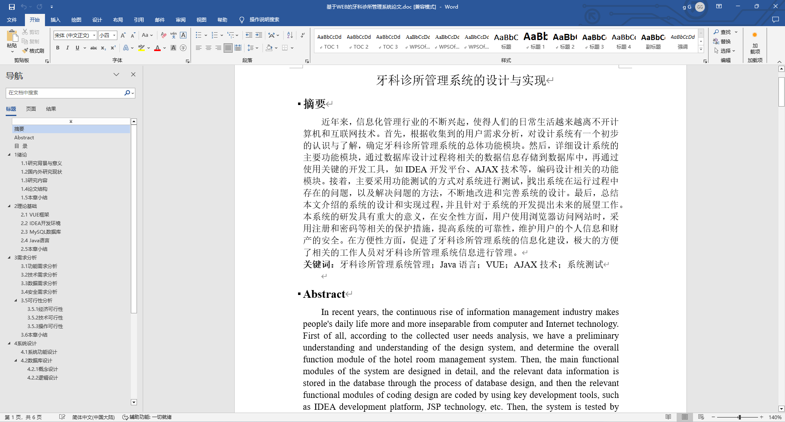
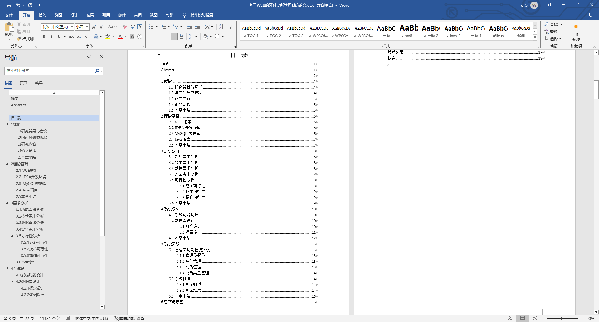
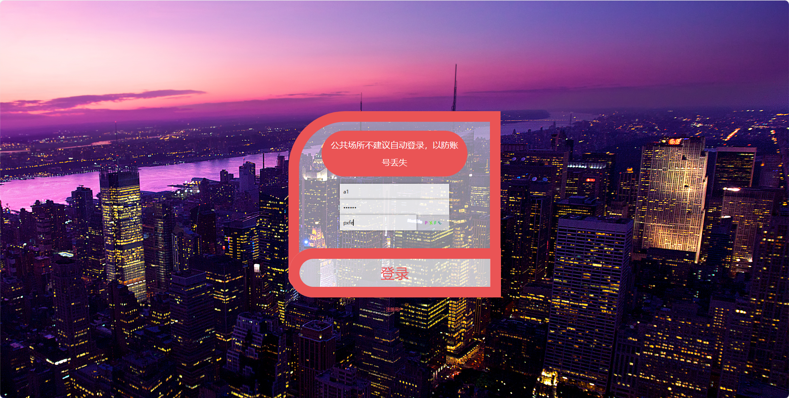
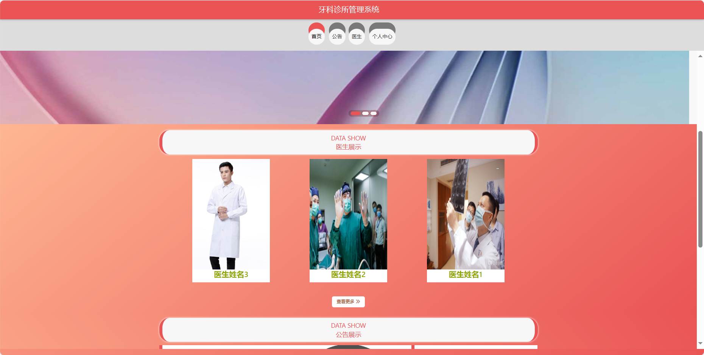
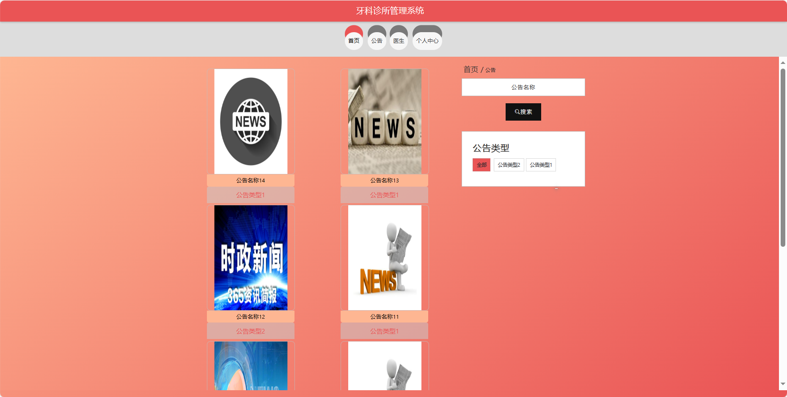
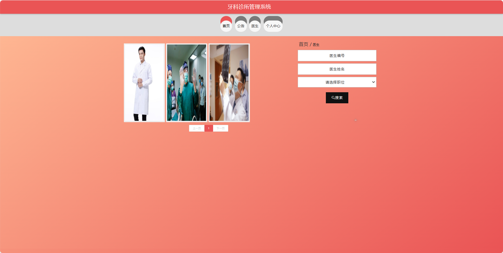
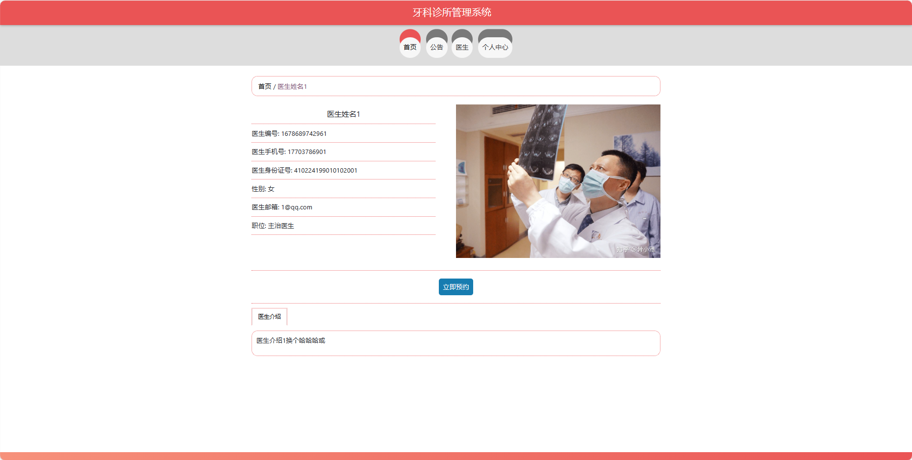
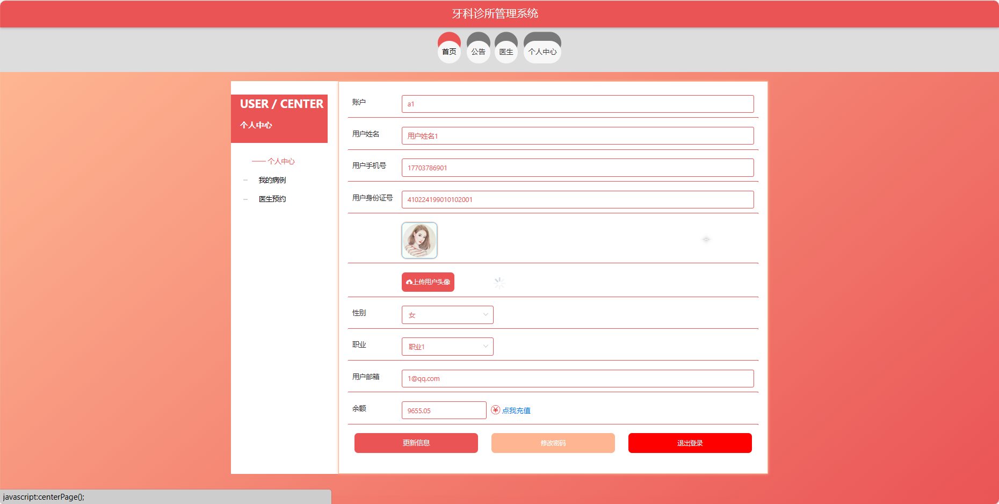

基于Springboot的牙科诊所管理系统（程序+论文）
=
### 完整代码获取地址：从戎源码网 ([https://armycodes.com/](https://armycodes.com/))
### 作者微信：19941326836  QQ：952045282 
### 承接计算机毕业设计、Java毕业设计、Python毕业设计、深度学习、机器学习
### 选题+开题报告+任务书+程序定制+安装调试+论文+答辩ppt 一条龙服务
### 所有选题地址https://github.com/nature924/allProject

一、项目介绍
---
基于Spring Boot框架实现的牙科诊所管理系统，系统包含三种角色：管理员、用户,医生主要功能如下。
### 【用户功能】

首页：浏览牙科诊所管理系统的主要信息。
公告：阅读系统发布的相关通知和公告。
医生：查看牙科诊所的医生信息，包括专业背景和出诊时间。
个人中心：管理个人信息，包括预约记录和历史病例。

### 【管理员功能】

首页：查看牙科诊所管理系统整体概况和关键数据。
个人中心：修改密码、管理个人信息。
管理员管理：审核和管理注册管理员用户的信息。
基础数据管理：管理系统的基础数据，病例类型、公告类型、职位和职业信息。
公告管理：发布、编辑和删除系统的通知和公告。
医生管理：审核和管理注册医生用户的信息。
医生预约管理：处理患者的医生预约请求，包括查看、确认等。
病例管理：查看和管理患者的病例信息，包括诊断和治疗记录。
用户管理：审核和管理注册用户的信息。
轮播图信息：管理系统首页的轮播图。

### 【医生功能】

首页：查看牙科诊所管理系统的信息。
个人中心：修改密码、管理个人信息。
公告管理：查看系统发布的通知和公告。
医生预约管理：查看患者的预约请求。
病例管理：记录和管理患者的病例信息。
用户管理：查看患者信息。

二、项目技术
---
- 编程语言：Java
- 数据库：MySQL
- 项目管理工具：Maven
- 前端技术：VUE、HTML、Jquery、Bootstrap
- 后端技术：Spring、SpringMVC、MyBatis

三、运行环境
---
- 操作系统：Windows、macOS都可以
- JDK版本：JDK1.8以上都可以
- 开发工具：IDEA、Ecplise、Myecplise都可以
- 数据库: MySQL5.7以上都可以
- Tomcat：任意版本都可以
- Maven：任意版本都可以

四、运行截图
---
### 论文截图：

### 程序截图：

